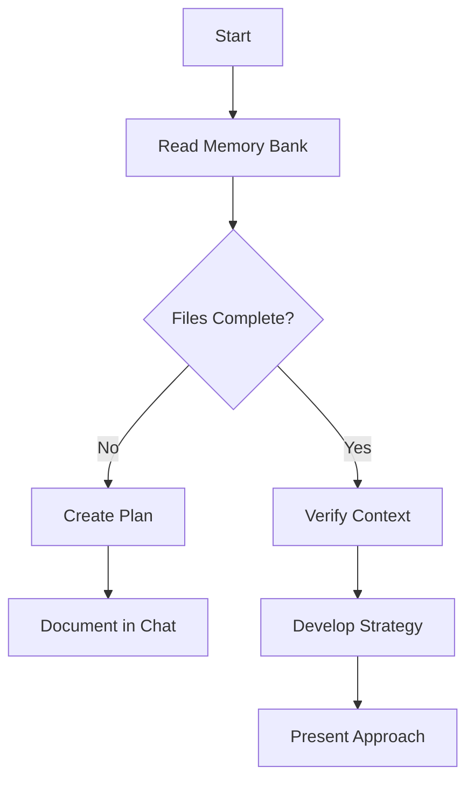
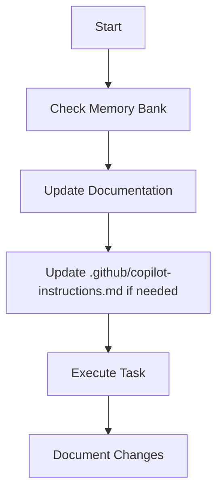

# Copilot Agent Memory Bank Instructions

## 1. メモリバンク運用哲学・前提

Copilot Agentはセッションごとに記憶がリセットされるため、プロジェクトの全コンテキストはmemory_bank配下のMarkdownファイルのみで管理・参照する。作業開始時は必ず全ファイルを読み、内容を把握してから行動する。

## 2. 構造・コアファイル

memory_bank/には以下のコアファイルを必ず設置し、内容を随時更新すること。

- activeContext.md: 現在の作業トピック・直近の変更・次のアクション
- productContext.md: プロダクトの存在理由・解決課題・ユーザー体験
- progress.md: 現状動作・残作業・既知課題
- projectbrief.md: プロジェクトの基礎要件・ゴール・唯一のスコープ情報源
- systemPatterns.md: システム構成・設計パターン・技術的意思決定
- techContext.md: 採用技術・開発環境・技術的制約・依存関係

必要に応じて追加のMarkdownファイルで詳細設計・API・テスト戦略等も管理可。

## 3. 命名・運用ルール

- ファイル名は英数字・ハイフン・アンダースコアのみ、日本語不可
- 完了タスクや過去履歴はprogress.md等のアーカイブ欄に残さず、仕様書やproductContext.md等で管理
- memory_bank/配下は「現状のアクティブな情報・タスク」のみを記載
- タスクは「未完了」「進行中」「次にやるべきこと」のみ明確に記載
- 完了タスクはactiveContext.mdやprogress.mdから速やかに除外し、必要に応じてdocs/やproductContext.md等に記録
- タスク粒度は「着手・完了判定が明確」な単位で分割
- memory_bank/配下の更新は必ずコミット履歴に残す
- 大きな変更時は、何を・なぜ変更したかを明記
- 運用ルール自体の変更もpull request等で合意の上で実施

## 4. ワークフロー

### Plan Mode

### Act Mode

### Documentation Updates

- 新たなパターン発見時
- 重要な変更実装後
- ユーザーから「update memory bank」指示時（全ファイル必読・必要に応じて更新）
- 文脈の明確化が必要なとき

特にactiveContext.mdとprogress.mdは現状把握の要なので重点的に管理する。

## 5. プロジェクト知識の蓄積

- .github/instructions/はプロジェクトごとの学習・知見・パターン・ユーザー要望・意思決定の記録用
- コードやmemory_bankから読み取れない重要な知見はここに随時追記
- Copilot Agentはこのファイルも必ず参照し、作業に活かす

---
